# 🅿️ Parking Lot Detection: YOLOv11 vs YOLOv12
### A Rigorous Comparative Analysis for Real-Time Occupancy Detection

<p align="center">
  
  
  
  
  
</p>

<p align="center">
  <b>YOLOv12 achieves 98.8% mAP50 and runs 27% faster than YOLOv11 on parking lot occupancy detection.</b><br/>
  <i>Tested on PKLot data, satellite imagery, drone footage, and CCTV - with and without AI enhancement.</i>
</p>

---

## Table of Contents

- [Overview](#overview)
- [Key Results](#key-results)
- [Dataset](#dataset)
- [Methodology](#methodology)
- [Hyperparameter Search](#hyperparameter-search)
- [Training Results](#training-results)
- [Evaluation](#evaluation)
- [Qualitative Results](#qualitative-results)
- [Out-of-Domain Testing](#out-of-domain-testing)
- [Final Verdict](#final-verdict)
- [Project Structure](#project-structure)
- [Getting Started](#getting-started)
- [Dependencies](#dependencies)
- [References](#references)

---

## Overview

This project implements and rigorously compares **YOLOv11** and **YOLOv12** for parking lot occupancy detection, classifying each parking space as either **space-empty** (green) or **space-occupied** (red).

The goal goes beyond simply training two models - this study evaluates them across multiple dimensions: accuracy (mAP, IoU), efficiency (FPS, FLOPs, model size), training stability (loss curves), and real-world robustness (out-of-domain satellite, drone, and CCTV images). The result is a deployment recommendation grounded in both quantitative and qualitative evidence.

**Skills demonstrated:** Object detection, model comparison, hyperparameter tuning, transfer learning, out-of-domain generalization, computer vision, Python, PyTorch, Ultralytics YOLO.

---

## Key Results

### Overall mAP Comparison

| Metric | YOLOv11 | YOLOv12 | Winner |
|---|---|---|---|
| mAP50 | 0.987 | **0.988** | YOLOv12 |
| mAP50-90 | 0.822 | **0.830** | YOLOv12 |
| Inference Speed (FPS) | 29.78 | **38.52** | YOLOv12 (+27%) |

### Per-Class mAP

| Class | YOLOv11 mAP50 | YOLOv11 mAP50-90 | YOLOv12 mAP50 | YOLOv12 mAP50-90 |
|---|---|---|---|---|
| space-empty | 0.983 | 0.827 | **0.986** | **0.835** |
| space-occupied | 0.990 | 0.813 | **0.991** | **0.825** |

<p align="center">
  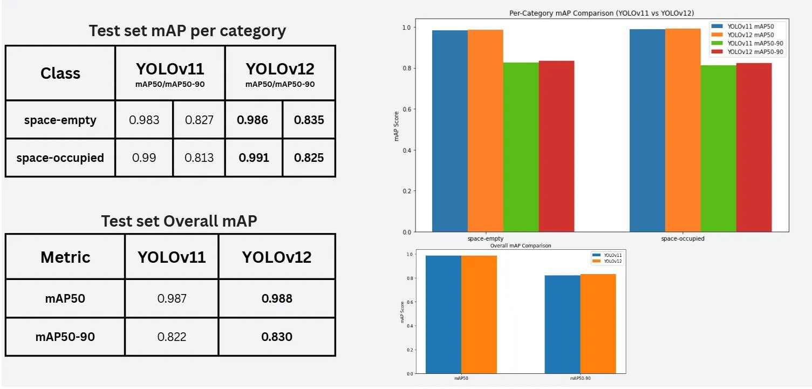
</p>

> **Figure 1:** Per-category and overall mAP50/mAP50-90 comparison between YOLOv11 and YOLOv12 on the PKLot test set.

---

## Dataset

### PKLot Dataset

The [PKLot dataset](https://www.kaggle.com/datasets/ammarnassanalhajali/pklot-dataset) is a large-scale parking lot benchmark captured from CCTV cameras at multiple locations under varying weather and lighting conditions. Each image is annotated with bounding boxes for every individual parking space, labeled as either empty or occupied.

| Split | space-empty | space-occupied |
|---|---|---|
| Train | 265,908 | 231,948 |
| Validation | 73,629 | 69,687 |

<p align="center">
  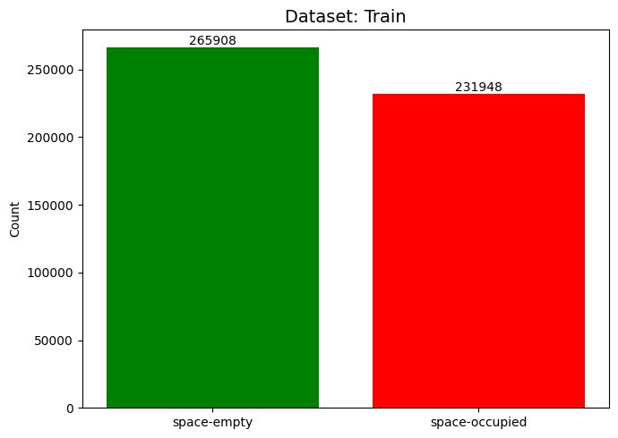
  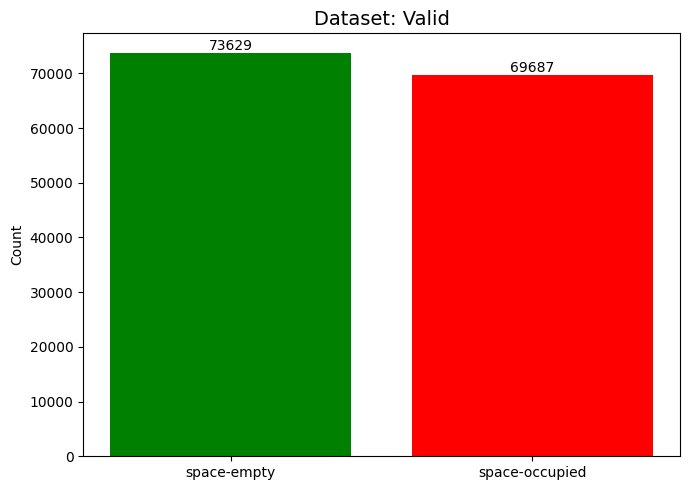
</p>

> **Figure 2:** Class distribution for train and validation splits - both classes are well-balanced.

### Dataset Samples

<p align="center">
  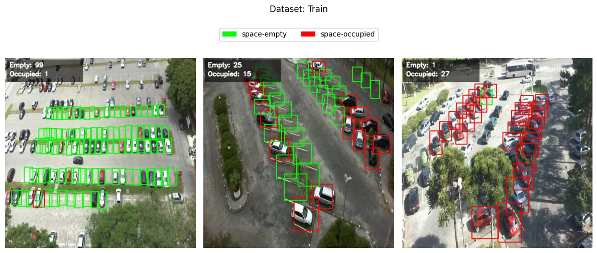
</p>

> **Figure 3:** Sample training images showing varied parking lot angles, densities, and occupancy levels.

<p align="center">
  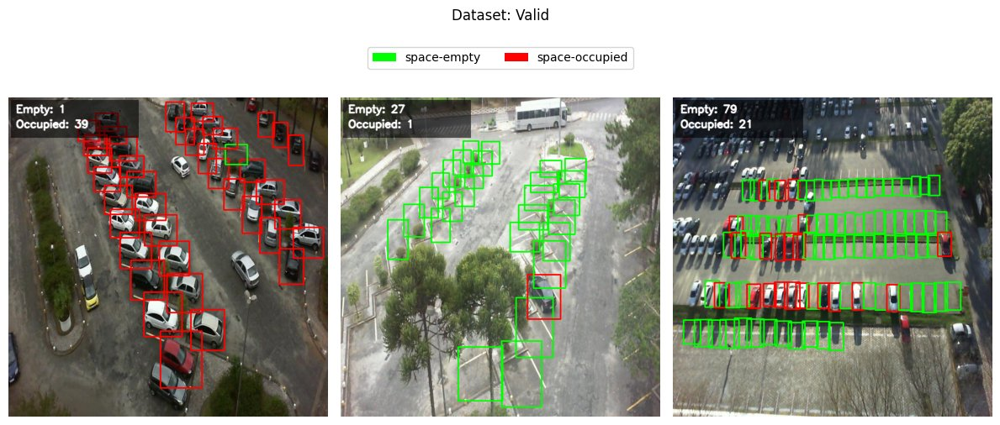
</p>

> **Figure 4:** Sample validation images - the dataset covers a diverse range of real-world parking scenarios.

---

## Methodology

Both models were trained using the **Ultralytics YOLO** framework with the following shared configuration:

| Setting | Value |
|---|---|
| Epochs | 5 |
| Image size | 640 x 640 |
| Batch size | 16 |
| Optimizer | AdamW (best from hyperparameter search) |
| Learning rate | 0.001 (best from hyperparameter search) |
| Classes | 2 (space-empty, space-occupied) |
| Hardware | GPU (L4 on Kaggle / Colab) |

Both models were initialized from pretrained weights and fine-tuned on the PKLot dataset. All hyperparameters were tuned independently for each model before the final training run.

---

## Hyperparameter Search

A structured hyperparameter search was conducted for each model, varying learning rate (lr0) and optimizer. AdamW with lr0=0.001 consistently outperformed SGD for both models.

### YOLOv11 Hyperparameter Search

<p align="center">
  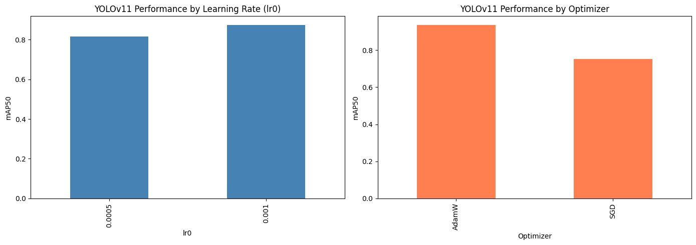
</p>

> **Figure 5:** YOLOv11 - AdamW with lr0=0.001 gives the best mAP50 on validation.

### YOLOv12 Hyperparameter Search

<p align="center">
  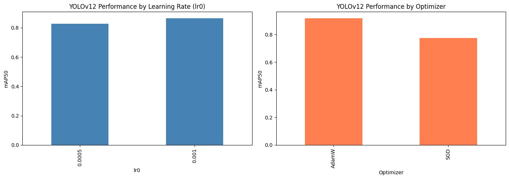
</p>

> **Figure 6:** YOLOv12 - Same trend: AdamW with lr0=0.001 is optimal.

---

## Training Results

### YOLOv11 Training

<p align="center">
  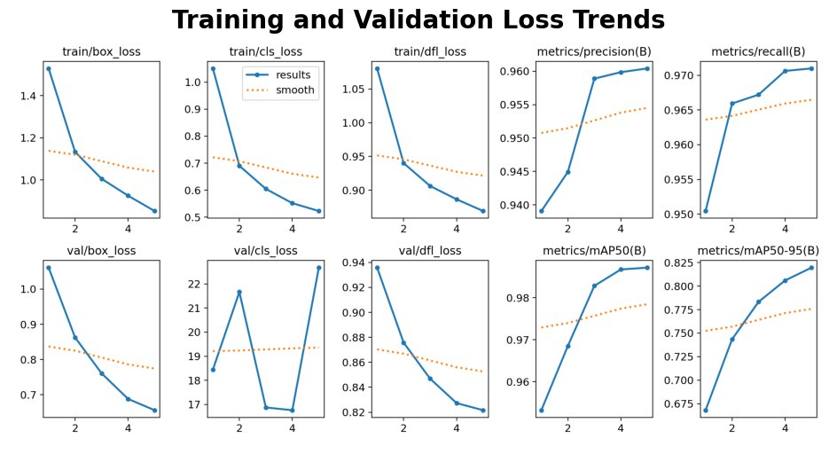
</p>

> **Figure 7:** YOLOv11 training and validation loss trends across 5 epochs. Box loss, classification loss, and DFL loss all decrease steadily. mAP50 and mAP50-90 improve consistently.

**Loss Curves - YOLOv11**

<p align="center">
  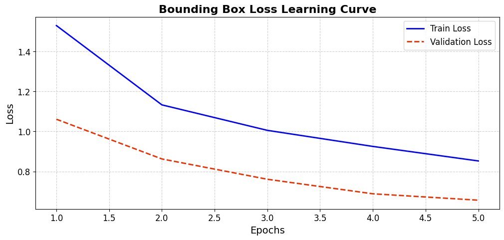
</p>

> **Figure 8:** YOLOv11 bounding box loss - both train and validation decrease cleanly, indicating good convergence.

<p align="center">
  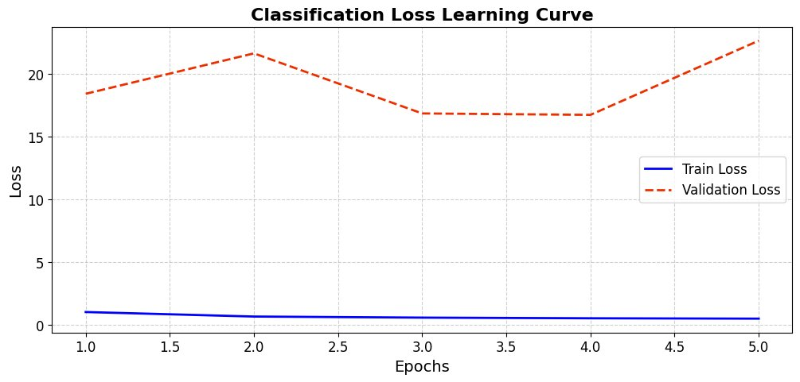
</p>

> **Figure 9:** YOLOv11 classification loss - training converges well; validation loss fluctuates slightly, a known behavior with large class imbalance in background predictions.

<p align="center">
  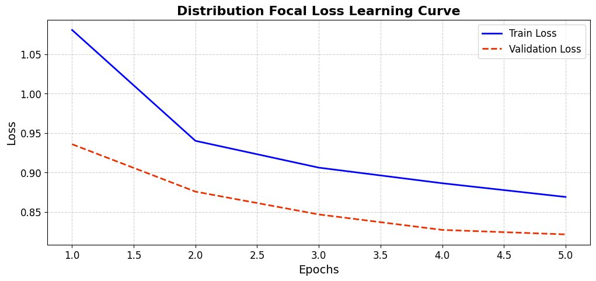
</p>

> **Figure 10:** YOLOv11 distribution focal loss - smooth decreasing trend for both train and validation.

### YOLOv12 Training

<p align="center">
  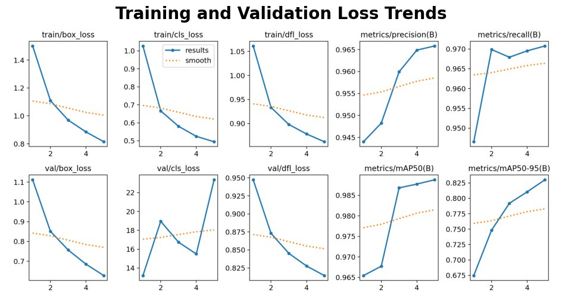
</p>

> **Figure 11:** YOLOv12 training and validation loss trends. Very similar convergence behavior to YOLOv11, with slightly better final mAP50 and mAP50-90.

**Loss Curves - YOLOv12**

<p align="center">
  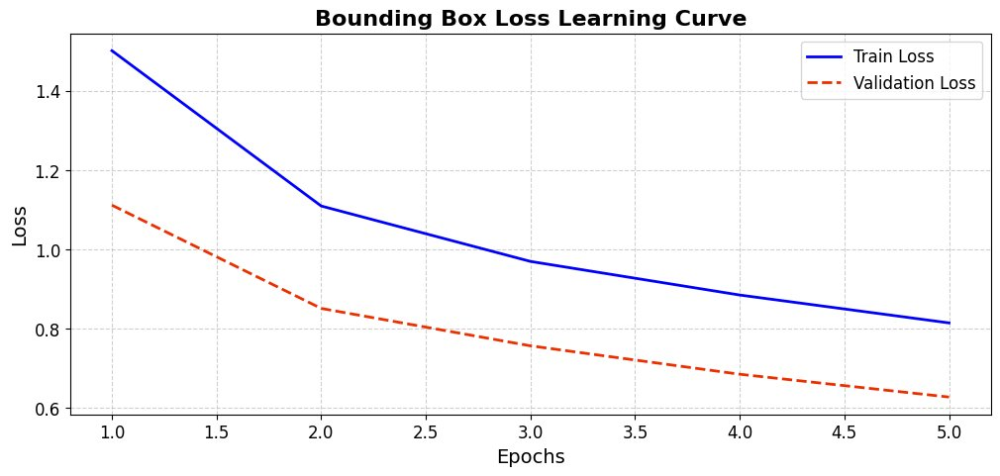
</p>

> **Figure 12:** YOLOv12 bounding box loss - clean convergence, validation loss decreasing below training loss indicates strong generalization.

<p align="center">
  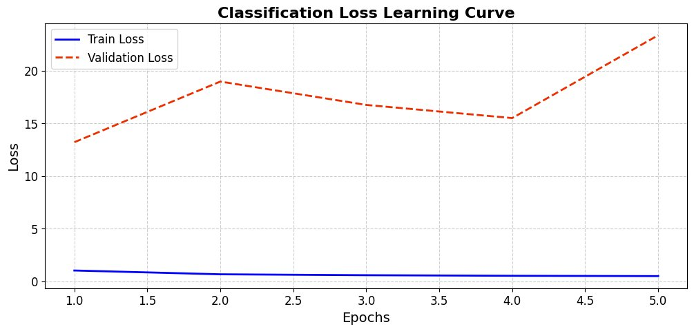
</p>

> **Figure 13:** YOLOv12 classification loss - same pattern as YOLOv11; training converges near zero while validation fluctuates due to background class predictions.

<p align="center">
  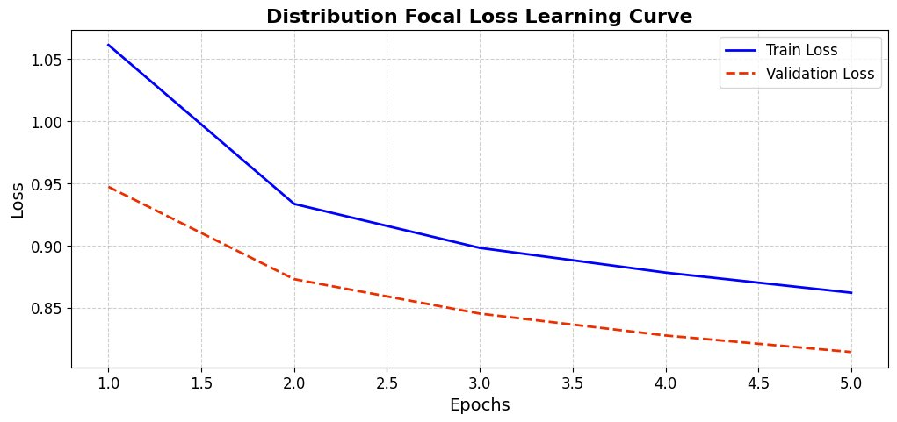
</p>

> **Figure 14:** YOLOv12 distribution focal loss - smooth and consistent convergence.

---

## Evaluation

### YOLOv11 Evaluation Curves

<p align="center">
  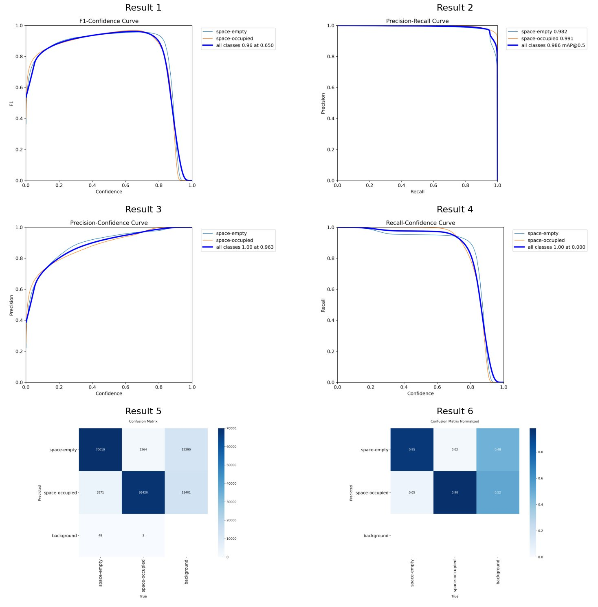
</p>

> **Figure 15:** YOLOv11 evaluation - F1-Confidence curve (peak F1=0.96 at conf=0.65), Precision-Recall curve (mAP@0.5=0.986), Precision-Confidence, Recall-Confidence, and Confusion Matrix (raw + normalized).

### YOLOv12 Evaluation Curves

<p align="center">
  
</p>

> **Figure 16:** YOLOv12 evaluation - F1-Confidence curve (peak F1=0.97 at conf=0.689), Precision-Recall curve (mAP@0.5=0.989), Precision-Confidence, Recall-Confidence, and Confusion Matrix. YOLOv12 shows marginally better F1 and PR curves across both classes.

---

## Qualitative Results

### Bounding Box Predictions vs Ground Truth

<p align="center">
  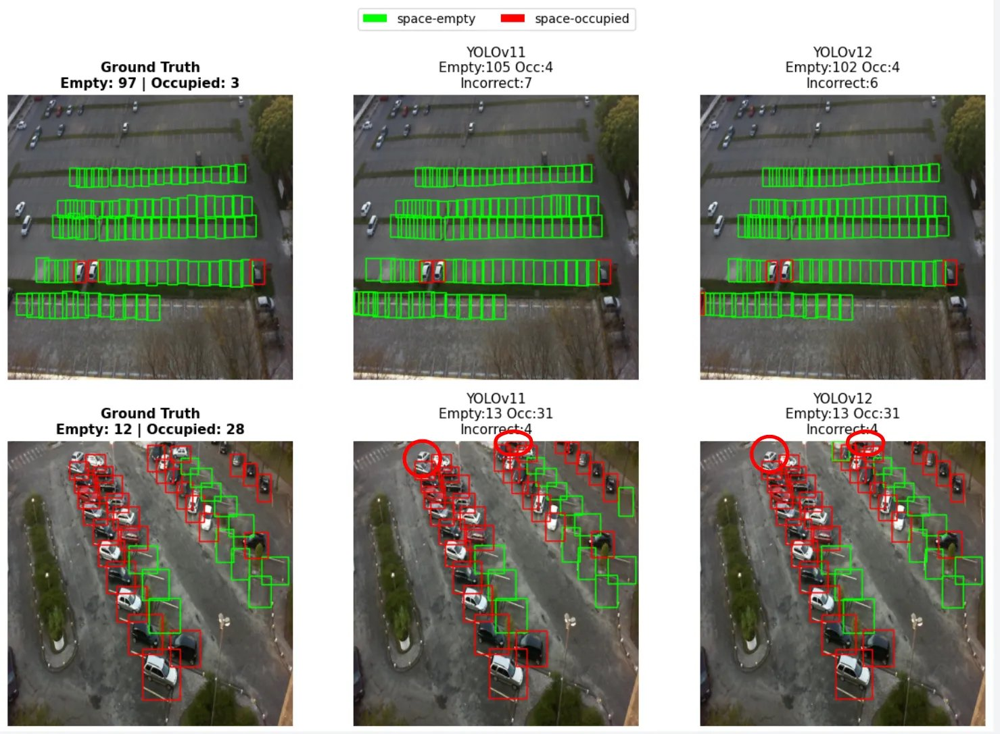
</p>

> **Figure 17:** Side-by-side comparison of Ground Truth, YOLOv11 predictions, and YOLOv12 predictions on two test images. Green = empty, Red = occupied. YOLOv11 detected 7 incorrect spaces vs YOLOv12's 6 on the first sample.

<p align="center">
  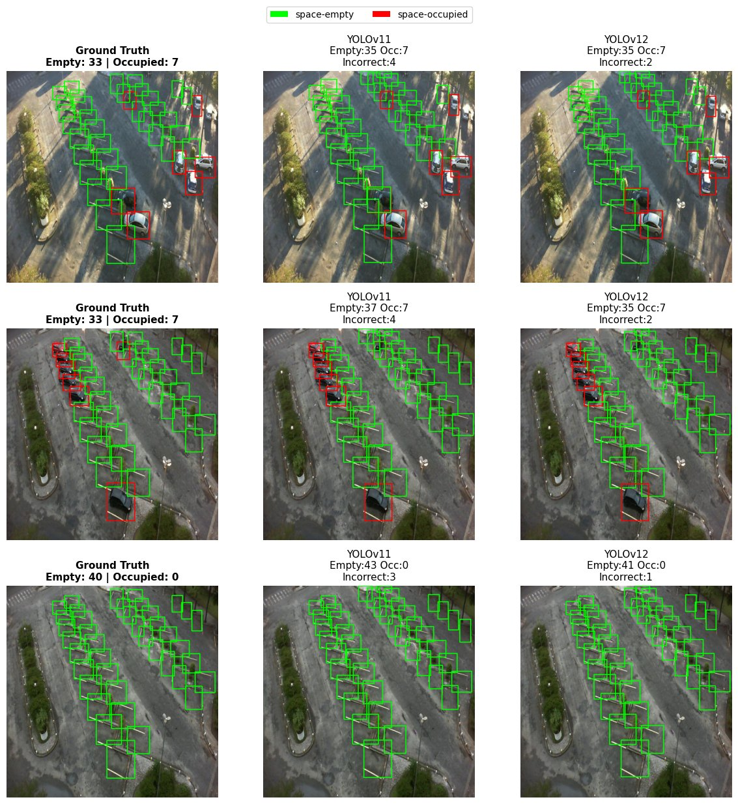
</p>

> **Figure 18:** Additional test samples showing three scenes. YOLOv12 consistently produces fewer incorrect detections than YOLOv11 - 2 vs 4 on the first two scenes, and 1 vs 3 on the fully empty lot.

### YOLOv12 on Aerial/Drone Images

<p align="center">
  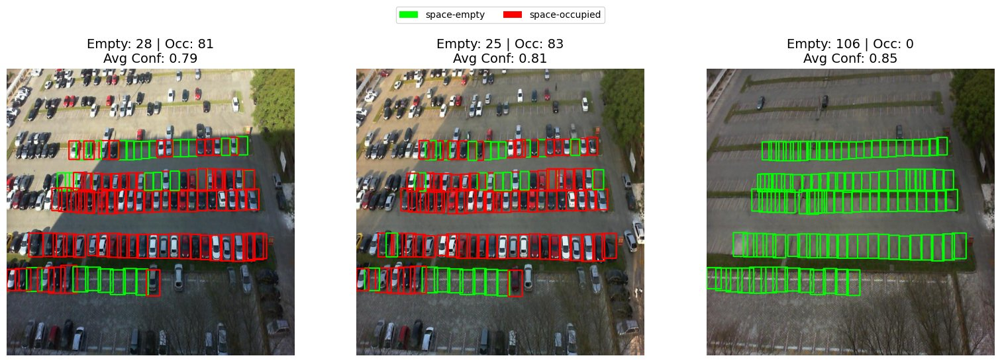
</p>

> **Figure 19:** YOLOv12 inference on aerial/drone images not seen during training. The model generalizes well to drone-captured parking lots, correctly identifying both empty and occupied spaces at high confidence (avg conf 0.79-0.85).

---

## Out-of-Domain Testing

To assess real-world applicability, YOLOv12 was tested on completely unseen image types: raw satellite imagery, AI-enhanced satellite imagery, drone images, and CCTV footage.

### Satellite Imagery - Raw vs AI-Enhanced

<p align="center">
  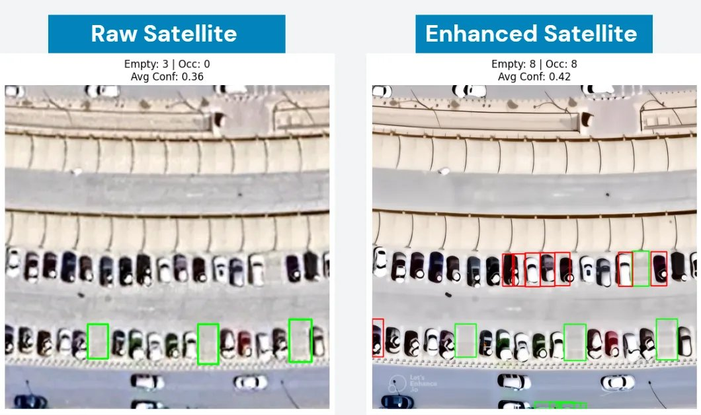
</p>

> **Figure 20:** YOLOv12 on raw vs AI-enhanced satellite images. Raw satellite: only 3 empty spaces detected (avg conf 0.36). After AI-based image enhancement: 8 empty + 8 occupied detected (avg conf 0.42). Enhancement significantly improves detection confidence on compressed, high-altitude imagery.

### Key Out-of-Domain Findings

| Image Type | Result |
|---|---|
| PKLot test images | Both models detect some extra spaces beyond ground truth labels |
| Raw satellite images | YOLOv12 detects empty spaces but struggles with compressed, distant cars |
| AI-enhanced satellite | Confidence improves, occupied spaces correctly detected |
| Drone images (similar angle to training) | YOLOv12 accurately detects both classes |
| CCTV images (unusual angles) | Both models struggle - a known limitation of the training data distribution |

---

## Final Verdict

> **YOLOv12 is selected as the best model for parking lot occupancy detection.**

| Criterion | YOLOv11 | YOLOv12 | Winner |
|---|---|---|---|
| mAP50 | 0.987 | 0.988 | YOLOv12 |
| mAP50-90 | 0.822 | 0.830 | YOLOv12 |
| Inference Speed | 29.78 FPS | 38.52 FPS | YOLOv12 (+27%) |
| Out-of-domain generalization | Good | Better | YOLOv12 |
| False positive tendency | Higher | Lower | YOLOv12 |

YOLOv12 offers slightly higher accuracy across all metrics, substantially faster inference (critical for real-time deployment on constrained hardware), and better generalization to unseen image types. YOLOv11 remains a valid choice in setups requiring conservative detection behavior or where a more cautious false-positive profile is acceptable.

---

## Project Structure

```
YOLOv11-vs-YOLOv12-Parking-Detection/
├── yolov11-vs-yolov12-comparative-analysis.ipynb   # Full notebook
├── README.md
└── assets/
    ├── map_comparison.png       # Fig 1  - mAP tables and bar charts
    ├── train_dist.png           # Fig 2a - Train class distribution
    ├── val_dist.png             # Fig 2b - Validation class distribution
    ├── dataset_train.png        # Fig 3  - Train sample images
    ├── dataset_val.png          # Fig 4  - Validation sample images
    ├── v11_hyperparam.png       # Fig 5  - YOLOv11 hyperparameter search
    ├── v12_hyperparam.png       # Fig 6  - YOLOv12 hyperparameter search
    ├── v11_loss_trends.png      # Fig 7  - YOLOv11 loss trends
    ├── v11_bbox_loss.png        # Fig 8  - YOLOv11 bbox loss curve
    ├── v11_cls_loss.png         # Fig 9  - YOLOv11 classification loss
    ├── v11_dfl_loss.png         # Fig 10 - YOLOv11 DFL loss
    ├── v12_loss_trends.png      # Fig 11 - YOLOv12 loss trends
    ├── v12_bbox_loss.png        # Fig 12 - YOLOv12 bbox loss curve
    ├── v12_cls_loss.png         # Fig 13 - YOLOv12 classification loss
    ├── v12_dfl_loss.png         # Fig 14 - YOLOv12 DFL loss
    ├── v11_eval_curves.png      # Fig 15 - YOLOv11 evaluation curves
    ├── v12_eval_curves.png      # Fig 16 - YOLOv12 evaluation curves
    ├── bbox_test.png            # Fig 17 - Bounding box test comparison
    ├── bbox_test2.png           # Fig 18 - Additional bounding box comparison
    ├── drone_detection.png      # Fig 19 - Drone image detection
    └── satellite.png            # Fig 20 - Satellite raw vs enhanced
```

---

## Getting Started

### Prerequisites

```bash
pip install ultralytics
pip install torch torchvision
pip install pandas numpy matplotlib
```

### Running the Notebook

1. **Clone the repository**
```bash
git clone https://github.com/qu-romana/YOLOv11-vs-YOLOv12-Parking-Detection.git
cd YOLOv11-vs-YOLOv12-Parking-Detection
```

2. **Download the PKLot dataset**
Available at: https://www.kaggle.com/datasets/ammarnassanalhajali/pklot-dataset

3. **Open the notebook** in Kaggle (recommended) or Google Colab with GPU:
```
yolov11-vs-yolov12-comparative-analysis.ipynb
```

4. **Run cells in order:**
   - Section 1: Dataset loading and EDA
   - Section 2: Hyperparameter search (YOLOv11)
   - Section 3: Hyperparameter search (YOLOv12)
   - Section 4: Final training (both models)
   - Section 5: Evaluation and comparison
   - Section 6: Out-of-domain testing

---

## Dependencies

| Library | Purpose |
|---|---|
| `ultralytics` | YOLOv11 and YOLOv12 training and inference |
| `torch` / `torchvision` | Deep learning backend |
| `pandas` / `numpy` | Data manipulation |
| `matplotlib` | Visualization and plotting |
| `PIL` | Image loading and preprocessing |

---

## References

1. Khanam, R. and Hussain, M. *YOLOv11: An Overview of the Key Architectural Enhancements.* arXiv:2410.17725, 2024.
2. Tian, Y. *YOLOv12: Attention-Centric Real-Time Object Detectors.* arXiv:2502.12524, 2025.
3. de Almeida, P. R. L., et al. *PKLot - A Robust Dataset for Parking Lot Classification.* Expert Systems with Applications, 2015.
4. Jocher, G., et al. *Ultralytics YOLO.* https://github.com/ultralytics/ultralytics, 2023.

---

## Author

**Romana Qureshi**
MS Artificial Intelligence, King Saud University

[](https://www.linkedin.com/in/romanaqureshi1613)
[](https://github.com/qu-romana)

---

<p align="center">
  <i>If this project helped you, consider giving it a star.</i> ⭐
</p>
